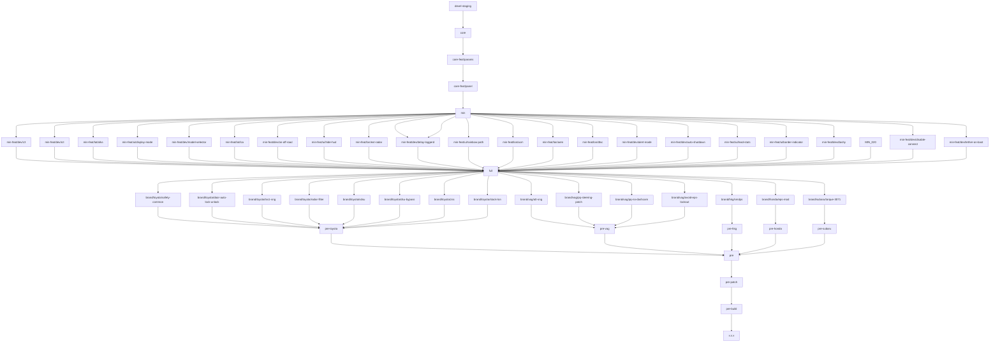

```mermaid
flowchart TD
    B000["devel-staging"] ---> CORE["core"]
    CORE ---> CORE_001["core-feat/params"]
    CORE_001 ---> CORE_002["core-feat/panel"]
    CORE_002 ---> MIN["min"]
    MIN ---> MIN_001["min-feat/dev/c3"]
    MIN ---> MIN_002["min-feat/dev/o3"]
    MIN ---> MIN_003["min-feat/lat/alka"]
    MIN ---> MIN_004["min-feat/ui/display-mode"]
    MIN ---> MIN_005["min-feat/dev/model-selector"]
    MIN ---> MIN_006["min-feat/lat/lca"]
    MIN ---> MIN_007["min-feat/dev/on-off-road"]
    MIN ---> MIN_008["min-feat/ui/hide-hud"]
    MIN ---> MIN_009["min-feat/lon/ext-radar"]
    MIN ---> MIN_010["min-feat/lat/road-edge-detection"]
    MIN ---> MIN_011["min-feat/ui/rainbow-path"]
    MIN ---> MIN_012["min-feat/lon/acm"]
    MIN ---> MIN_013["min-feat/lon/aem"]
    MIN ---> MIN_014["min-feat/lon/dtsc"]
    MIN ---> MIN_015["min-feat/dev/alert-mode"]
    MIN ---> MIN_016["min-feat/dev/auto-shutdown"]
    MIN ---> MIN_017["min-feat/ui/lead-stats"]
    MIN ---> MIN_018["min-feat/ui/border-indicator"]
    MIN ---> MIN_019["min-feat/dev/dashy"]
    MIN ---> MIN_010["min-feat/dev/delay-loggerd"]
    MIN ---> MIN_021["min-feat/dev/disable-connect"]
    MIN ---> MIN_022["min-feat/dev/tether-on-boot"]
    MIN_001 ---> FULL["full"]
    MIN_002 ---> FULL
    MIN_003 ---> FULL
    MIN_004 ---> FULL
    MIN_005 ---> FULL
    MIN_006 ---> FULL
    MIN_007 ---> FULL
    MIN_008 ---> FULL
    MIN_009 ---> FULL
    MIN_010 ---> FULL
    MIN_011 ---> FULL
    MIN_012 ---> FULL
    MIN_013 ---> FULL
    MIN_014 ---> FULL
    MIN_015 ---> FULL
    MIN_016 ---> FULL
    MIN_017 ---> FULL
    MIN_018 ---> FULL
    MIN_019 ---> FULL
    MIN_020 ---> FULL
    MIN_021 ---> FULL
    MIN_022 ---> FULL
    FULL ---> TOYOTA_001[brand/toyota/safety-common]
    FULL ---> TOYOTA_002[brand/toyota/door-auto-lock-unlock]
    FULL ---> TOYOTA_003[brand/toyota/tss1-sng]
    FULL ---> TOYOTA_004[brand/toyota/radar-filter]
    FULL ---> TOYOTA_005[brand/toyota/sdsu]
    FULL ---> TOYOTA_006[brand/toyota/dsu-bypass]
    FULL ---> TOYOTA_007[brand/toyota/zss]
    FULL ---> TOYOTA_008[brand/toyota/stock-lon]
    FULL ---> VAG_001[brand/vag/a0-sng]
    FULL ---> VAG_002[brand/vag/pq-steering-patch]
    FULL ---> VAG_003[brand/vag/pq-no-dashcam]
    FULL ---> VAG_004[brand/vag/avoid-eps-lockout]
    FULL ---> HKG_001[brand/hkg/smdps]
    FULL ---> HONDA_001[brand/honda/eps-mod]
    FULL ---> SUBARU_001[brand/subaru/torque-3071]
    TOYOTA_001 ---> TOYOTA[pre-toyota]
    TOYOTA_002 ---> TOYOTA
    TOYOTA_003 ---> TOYOTA
    TOYOTA_004 ---> TOYOTA
    TOYOTA_005 ---> TOYOTA
    TOYOTA_006 ---> TOYOTA
    TOYOTA_007 ---> TOYOTA
    TOYOTA_008 ---> TOYOTA
    VAG_001 ---> VAG[pre-vag]
    VAG_002 ---> VAG
    VAG_003 ---> VAG
    VAG_004 ---> VAG
    HKG_001 ---> HKG[pre-hkg]
    HONDA_001 ---> HONDA[pre-honda]
    SUBARU_001 ---> SUBARU[pre-subaru]
    TOYOTA ---> PRE[pre]
    VAG ---> PRE
    HKG ---> PRE
    HONDA ---> PRE
    SUBARU ---> PRE
    PRE ---> PRE_PATCH[pre-patch]
    PRE_PATCH ---> PREBUILD[pre-build]
    PREBUILD ---> VERSION[x.x.x]
```
